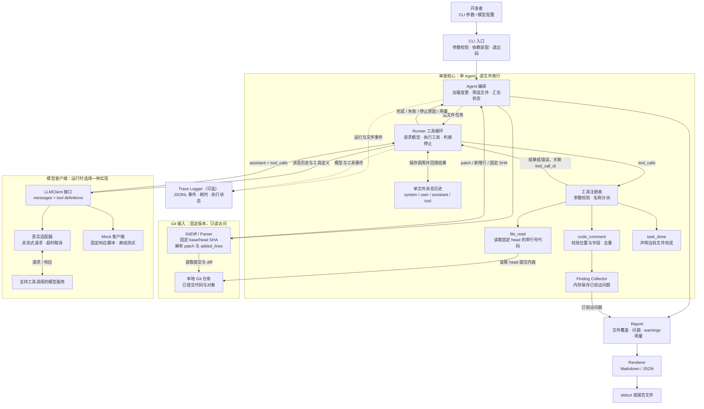

# Mini Code Review Agent 需求文档

> 版本：v0.1；定位：个人 Agent 开发练习；预计投入：7 天、每天 3～4 小时。
> 参考项目：`E:\study\alibaba`，Go 模块 `github.com/alibaba/open-code-review`。
> 本文基于当前工作区核心代码设计；第一周只完成 P0，P1 留到第二轮练习。

## 1. 项目目标

开发一个 Go 命令行工具，读取本地 Git 仓库两个提交之间的 Go 代码变更，让模型通过工具获取上下文、提交结构化问题，最后输出可定位的审查报告。

主要目标是练熟 Agent 工程的最小闭环，而非实现生产级审查平台：

1. 能区分流程编排、模型客户端、工具执行、消息历史和结果输出的职责。
2. 能独立实现“模型选择工具 → 程序执行工具 → 回填结果 → 模型继续决策”的循环。
3. 能处理模型参数错误、工具失败、超时和循环不结束等常见问题。
4. 能通过 Mock 和本地事件日志验证执行过程，而非只看最终回答。
5. 能解释 Agent 为什么读了某个文件、为什么接受某条问题、为什么停止。

**第一周完成标准：一个 CLI、一个 Agent、一个模型适配器、三个工具、两种报告格式、一套离线测试。** 不要求使用 Agent 框架。

时间估计的前提：已经能编写基础 Go 程序，熟悉 Git，有可用且支持工具调用的模型服务。如果 Go 和 HTTP 调用也需要从零学习，应适当延长周期。

## 2. 原项目核心链路与取舍

### 2.1 建议理解的真实链路

```text
cmd/opencodereview/review_cmd.go
  executeReviewContext：解析配置、准备模型客户端、注册工具、创建 Agent
    ↓
internal/agent/agent.go
  New：装配依赖，创建 llmloop.Runner
  Run：加载 diff、筛选文件、分派任务、汇总结果
  dispatchSubtasks：分组，并发执行组任务
  executeGroupSubtask：计划阶段、主审查、可选过滤和多轮审查
    ↓
internal/llmloop/loop.go
  RunMainTask：循环请求模型，读取 tool_calls，执行并回填工具结果
  executeToolCall：分派工具，处理评论和任务完成状态
  addNextMessage：维护下一轮消息，接入上下文压缩
    ↓
internal/tool/* + internal/model/review.go
  读取上下文、提交评论、收集结构化结果
    ↓
cmd/opencodereview/output.go
  输出文本或 JSON，呈现告警、用量和执行状态
```

注意：核心工具循环已经抽到 `internal/llmloop/loop.go`，不要只在 `agent.go` 中寻找全部 Agent 逻辑。分组既支持模型方式，也有确定性策略，不应理解为每次都必须调用模型分组。

### 2.2 原项目到 Mini 项目的映射

| 原项目代码 | 学习重点 | Mini 版实现 |
| --- | --- | --- |
| `cmd/opencodereview/review_cmd.go`：`executeReviewContext` | 入口装配与业务逻辑分离 | 标准库 `flag` 解析参数，装配依赖 |
| `internal/agent/agent.go`：`New`、`Run`、`loadDiffs` | 依赖注入与流程编排 | 加载 diff，按文件串行调用 Runner，汇总报告 |
| `internal/agent/grouping.go`；`agent.go`：`dispatchSubtasks` | 工作单元划分 | 每个文件一个任务，不做语义分组和并发 |
| `agent.go`：`executeGroupPlanPhase` | 计划与执行分离 | P1；P0 直接进入工具循环 |
| `internal/llmloop/loop.go`：`RunMainTask`、`executeToolCall`、`addNextMessage` | Agent 最重要的决策闭环 | 自己实现短小 Runner，不搬入压缩、后台任务等依赖 |
| `internal/llm/client.go`：`LLMClient`、`Message`、`ToolCall` | 隔离模型协议 | 一个客户端接口，真实与 Mock 两种实现 |
| `internal/tool/definitions.go`：`Provider`、`Registry` | 工具契约与注册 | 固定名称到工具实现的 map |
| `internal/tool/file_read.go`、`filereader.go` | 带行号的上下文读取、版本一致性 | 固定从 head 提交读取内容 |
| `internal/tool/code_comment.go`、`comment_collector.go` | 结构化评论与收集 | 每次提交一条 Finding，立即校验和去重 |
| `internal/diff/parser.go`、`hunk.go` | patch 解析与新旧行号 | 只实现普通文本 hunk 和新增行映射 |
| `internal/model/review.go` | 结果字段建模 | 精简 Finding 和 Report，不保存模型内部思考 |
| `internal/telemetry/span.go`：`StartLLMSpan`、`StartToolSpan`、结果记录函数 | 模型/工具耗时与状态可观测性 | 本地 JSONL 事件日志；不接 OpenTelemetry 后端 |
| `internal/config/template/prompts/main_task_system.md` | 审查边界与完成协议 | 一个固定英文系统提示词 |
| `cmd/opencodereview/output.go` | 输出与业务处理解耦 | Markdown/JSON 两个简单 renderer |

借鉴职责和协议，不直接复制整个包。原项目 `internal` 包也不能被新建的独立 Go 模块直接导入。

### 2.3 Mini 项目架构图（P0）

下图展示第一周需要实现的模块。实线表示调用或数据流，虚线表示事件日志；每个文件独立运行一轮审查任务，任务内部可以多次调用模型。



模块边界：

- **Agent 管流程**：决定审查哪些文件、串行调度任务、汇总覆盖与状态。
- **Runner 管闭环**：维护消息、调用客户端、执行模型选择的工具，并落实轮次、超时和完成规则。
- **工具管能力**：读取代码、提交问题、声明结束；工具结果统一经注册表返回 Runner，再写入消息历史。
- **Git 层管版本一致性**：diff 使用固定 base/head，`file_read` 使用同一个 head；工作区内容不参与本次审查。
- **Report 与 Trace 管产物**：报告呈现审查结论，日志帮助复盘模型与工具的执行过程。

`task_done` 仅是完成声明，是否接受由 Runner 按第 6 节的协议判断。真实客户端和 Mock 实现同一个接口，切换时不改变 Agent、Runner 和工具代码。

## 3. 使用场景与范围

### 3.1 主要场景

作为开发者，我完成一个小功能并提交后，希望在合并前对比基线提交和当前提交，获取有代码位置、问题原因与改进建议的反馈，并查看 Agent 的工具调用过程。

默认比较 `HEAD~1` 与 `HEAD`；可显式指定两个分支、标签或提交。启动时将两端解析并固定为 commit SHA。Mini 采用 **base 到 head 的直接比较**，不自动计算 merge-base；需要分支合并语义时，由用户传入合适的基线。

### 3.2 P0 必须完成

- 本地 Git 仓库的已提交版本对比；只审查 `.go` 文件。
- 支持普通修改和新增文件；解析多个 hunk 的新文件行号。
- 单 Agent，按路径排序后逐文件串行审查，每个文件独立消息历史。
- 三个工具：`file_read`、`code_comment`、`task_done`。
- 一个支持工具调用的模型服务适配器；非流式请求。
- 结构化问题校验、简单去重、Markdown/JSON 报告。
- 有限轮次、请求超时、上下文大小限制和离线 Mock。
- 可选 JSONL 日志，记录模型和工具执行事件。

### 3.3 P1 可选练习

按顺序逐个增加，不能挤占第一周测试时间：

1. `code_search`：在固定 head 版本搜索字面字符串，限制返回条数。
2. 单次 Plan：模型先输出审查重点，作为主循环上下文；它不是问题结论，也不是覆盖范围上限。
3. 工作区或暂存区模式：重新设计版本一致性后实现。
4. 两个文件的并发审查：处理结果收集和日志顺序。

### 3.4 本期不做

Web UI、IDE 插件、PR 评论发布、多 Agent、MCP、RAG/向量库、数据库、会话恢复、后台反思、自动修复、流式输出、多供应商兼容、精确费用预算、模型上下文压缩和全仓扫描。

第一版重点审查 bug、安全和明确的边界条件问题；不做格式、命名、注释质量等风格检查。发现问题后仅给建议，不修改被审查仓库。

## 4. 命令行需求

命令名暂定 `mini-review`，使用标准库 `flag` 即可，不需要多级子命令。

```powershell
# 默认审查最近一次提交，Markdown 输出到 stdout
mini-review --repo E:\study\demo

# 指定比较范围和业务背景，报告与执行日志分开保存
mini-review --repo E:\study\demo --base main --head HEAD --background "Add request timeout handling" --format markdown --output review.md --trace trace.jsonl

# 不调用真实模型，用固定响应脚本验证闭环
mini-review --repo E:\study\demo --mock --format json
```

| 参数 | 默认值 | 说明 |
| --- | --- | --- |
| `--repo` | 当前目录 | Git 仓库路径，解析到仓库根目录 |
| `--base` | `HEAD~1` | 基线，启动时解析为 commit SHA |
| `--head` | `HEAD` | 目标，启动时解析为 commit SHA |
| `--background` | 空 | 用户提供的功能背景，作为数据加入提示词 |
| `--format` | `markdown` | 仅接受 `markdown` 或 `json` |
| `--output` | 空 | 空表示 stdout；指定时写入文件 |
| `--trace` | 空 | 指定时记录 JSONL 事件日志 |
| `--max-rounds` | `8` | 每个文件最多发起的模型请求数，允许 1～20 |
| `--mock` | `false` | 固定脚本客户端；不要求模型配置，不发网络请求 |

真实模式从 `MINI_LLM_ENDPOINT`、`MINI_LLM_MODEL`、`MINI_LLM_API_KEY` 读取配置，不额外实现配置文件。选择一个实际可用的模型协议实现即可；必须先验证该模型支持工具调用。本文不绑定某个供应商或当前型号。

退出码：`0` 表示完整执行或无适用文件；`1` 表示失败或不完整；`2` 表示命令行参数不合法。发现问题本身不导致非零退出。

stdout 仅用于报告，诊断和进度写 stderr。指定 `--output` 或 `--trace` 时，在模型请求前检查路径可写；对已有文件明确报错，避免静默覆盖。

## 5. 输入与 Diff 处理

1. 检查 Git 可用、仓库存在、base/head 能解析为提交。根提交没有 `HEAD~1` 时提示用户显式传入有效基线，不自动猜测。
2. 通过参数数组调用 Git，禁止拼接 shell 命令；拒绝以 `-` 开头的 ref，使用 ref 校验与选项结束机制。
3. 固定两端 SHA 后获取文件列表和普通 unified diff，关闭外部 diff、textconv、颜色和 rename detection。
4. 文件列表用 NUL 分隔；文件路径不从简单的空格切分中取得。重命名按删除旧文件、新增新文件处理，旧文件不作为评论目标。
5. 每个 patch 独立解析 hunk：空格行递增新旧行号，`+` 行只递增新行号，`-` 行只递增旧行号；文件头和无末尾换行标记不计为新增代码。
6. 给新增行附上目标版本的真实行号，记录 `added_lines`。修改在 patch 中也是删除加新增。
7. diff 与工具读取都使用固定 head SHA，不读取当前工作区内容；用户的未提交修改不进入本次审查。

第一版只接受普通 UTF-8 Go 文本，跳过删除文件、二进制、`vendor/`、`testdata/`、以标准生成标记 `// Code generated ... DO NOT EDIT.` 标识的文件。特殊类型如符号链接不审查；路径含控制字符时跳过并说明原因。普通空格路径需要支持。

默认范围上限：8 个候选审查文件、合计 400 行新增/删除；超出任一整体上限，在模型调用前返回失败并建议缩小比较范围，不默默只取前几个。单文件 patch 超过 32 KiB 时跳过并产生 warning；其余文件继续审查，报告标记为不完整。

每轮发送前检查消息正文与工具参数总计不超过 64 KiB；超限即结束当前文件，记录 `context_limit`。字节上限只是工程保护，不代表精确 token 预算。P0 不做截断后继续审查或上下文压缩。

## 6. Agent 执行协议

### 6.1 初始上下文

每个文件的首次消息只包括：

- 固定 system prompt：角色、审查规则、工具契约、完成方式。
- 用户背景、比较 SHA、完整变更文件路径列表。
- 当前文件的带行号 patch 和本次允许提交问题的新增行集合。

代码、注释和背景作为待分析数据包裹，不能提升为系统指令。提示词明确：只对当前文件新增/修改代码提交问题；相关文件只用于查证；没有证据时不编造问题。

### 6.2 最小循环

```text
加载并校验输入 → 筛选文件 → 按文件建立消息历史
    ↓
检查取消、轮次和上下文上限 → 调用模型
    ↓
保存 assistant 消息（包含原始 tool_calls）
    ↓
逐个校验参数、执行工具、追加对应 tool 消息
    ├─ task_done 合法且本轮没有工具错误 → 当前文件完成
    ├─ 达到停止条件 → 保留已验证结果，记录不完整状态
    └─ 其他情况 → 带完整历史请求下一轮
    ↓
汇总所有文件状态、问题、warning 和用量 → 输出报告
```

必需行为：

- 每条工具结果携带原 `tool_call_id`，包括失败结果；不能只把结果拼成一段 user 文本。
- 一轮有多个工具调用时串行执行全部调用并回填结果，再判断完成；不能遇到 `task_done` 就丢弃同轮后续评论。
- 工具返回规范化成功/失败 JSON；未知工具、非法 JSON、越界行号等作为失败结果回填，允许模型下一轮修正。
- 同轮任一工具失败时，不接受该轮的完成声明；合法完成需在后续轮次再次确认。
- 模型只输出普通文本、没有工具调用时，保留响应并提示使用工具；不能据此判定“未发现问题”。
- 连续两轮没有合法工具调用，或两轮所有调用均失败，停止为 `invalid_response`。有效读取、评论或完成声明会重置计数。
- 达到每文件轮次上限时停止为 `max_rounds`，不额外启动隐藏的补救轮次。
- 单次模型请求超时 60 秒，Git 请求超时 10 秒；支持 Ctrl+C 取消。P0 不实现自动重试。
- 某个文件模型请求失败，记录该文件失败，继续其余文件；全局取消则停止整个执行。已校验问题都应保留。

这是真正需要亲手实现的 Agent 部分：下一步读什么由模型选择，工具执行与状态维护由程序完成。仅把 diff 发给模型一次再打印回答，不能满足本项目目标。

## 7. 三个工具的需求

工具名称借鉴原项目，Mini 参数为自己的精简契约，不保证与原项目完全兼容。三个工具都提供名称、英文说明、JSON Schema；程序端仍需校验，不能只依赖模型遵守 Schema。

| 工具 | 参数 | 返回/副作用 |
| --- | --- | --- |
| `file_read` | `path`；可选 `start_line`、`end_line` | 返回固定 head 的带行号内容及截断标记 |
| `code_comment` | 一条完整 Finding | 校验、去重后加入内存 collector，返回 accepted 或错误 |
| `task_done` | `summary`：非空字符串 | 声明当前文件审查结束，由 Runner 判断是否可完成 |

### 7.1 file_read

- path 必须是仓库相对路径，统一以 `/` 表示；拒绝绝对路径、盘符、`..` 路径段和 NUL。
- 仅允许读取 head 提交中的普通 `.go` 文件，包括未变更的关联文件；仍遵守目录和生成文件排除规则。
- 用 Git 对象内容读取，不通过工作区路径跟随符号链接。
- 行号从 1 开始，默认读取前 120 行；每次最多 200 行、16 KiB，文件整体最多 256 KiB。
- 范围合法时按上限截断，并返回 `truncated`、实际起止行和总行数；不存在、范围非法或文件太大时返回错误。
- 获取的内容只增加背景知识，不扩大当前文件允许提交问题的范围。

### 7.2 code_comment

Finding 字段：`path`、`start_line`、`end_line`、`severity`、`category`、`title`、`description`、`suggestion`。

- severity 仅为 `high`、`medium`、`low`；category 仅为 `bug`、`security`、`performance`。
- title 简述问题；description 必须包含触发条件和影响；suggestion 为修复思路，不要求完整补丁。
- path 必须等于当前任务文件；行号为 head 版本真实行号。
- `1 <= start_line <= end_line <= 文件总行数`，且起始行必须属于 `added_lines`。这是 Mini 的简单锚点规则，不实现模型重新定位。
- 所有文本字段非空；title 最长 120 字符，其余字段各最长 2,000 字符。
- 用 `path + start_line + end_line + 归一化 title` 做精确去重，重复提交返回成功并说明 duplicate，不重复增加结果。
- 不实现语义去重、反思过滤、建议代码验证；因此结果仍需人复核，字段合法不代表问题一定真实。

### 7.3 task_done

允许没有任何问题时结束。summary 表示已经检查的内容，而非隐式提交评论；报告中的问题只能来自通过校验的 `code_comment`。

每个文件独立完成，不能用一次 `task_done` 宣布所有文件完成。Mini 不需要专门的失败工具，失败状态由 Runner 根据错误与停止条件生成。

## 8. 报告与可观测性

### 8.1 JSON 报告示例

```json
{
  "status": "completed",
  "base_sha": "<resolved-base-sha>",
  "head_sha": "<resolved-head-sha>",
  "files": [
    {"path": "internal/service.go", "status": "completed", "stop_reason": "task_done", "rounds": 3}
  ],
  "findings": [
    {
      "path": "internal/service.go",
      "start_line": 42,
      "end_line": 42,
      "severity": "high",
      "category": "bug",
      "title": "Nil result is dereferenced after a lookup failure",
      "description": "When lookup returns an error and a nil result, accessing result.ID causes a panic.",
      "suggestion": "Return or handle the lookup error before accessing result.ID."
    }
  ],
  "warnings": [],
  "usage": {"llm_requests": 3, "tool_calls": 3, "input_tokens": null, "output_tokens": null},
  "duration_ms": 1850
}
```

示例为格式说明，不是对当前仓库的真实问题结论。未返回 token usage 时用 `null`，不能伪装为零消耗。usage 统计整个运行，tool_calls 包括失败和结束调用。

状态规则：

- `completed`：所有应审查文件均通过 `task_done` 完成，问题数量可以为 0。
- `skipped`：没有适用的变更文件，不调用模型。
- `partial`：至少一个文件完成或留下已验证问题，同时存在失败、取消或大小限制导致的覆盖缺口。
- `failed`：输入/输出错误，或应审查的文件全部未完成且没有已验证问题。

报告中列出所有变更文件；静态排除项记录 `skipped` 和原因，不算覆盖缺口。大小限制和执行失败属于覆盖缺口。如果唯一候选文件因过大跳过，运行为 `failed`，不能冒充“没有适用文件”。

Markdown 展示比较范围、执行状态、文件覆盖、问题、warnings 和请求统计。每条问题至少展示 `path:start_line`、严重程度、原因与建议。只有 `completed` 且零问题时可写“本次审查未发现问题”；不完整运行必须明确提示审查未完成。

### 8.2 JSONL 事件日志

借鉴 `span.go` 对模型和工具记录耗时、状态的思路，每行一条事件：

```json
{"run_id":"demo-run","event":"tool_end","file":"internal/service.go","round":2,"tool":"file_read","tool_call_id":"call_1","duration_ms":4,"status":"ok"}
```

至少记录 `run_start`、`file_start`、`llm_start`、`llm_end`、`tool_start`、`tool_end`、`file_end`、`run_end`。共同字段包含 run_id、时间；按事件增加 file、round、tool_call_id、耗时、错误码和服务实际返回的用量。

默认不记录 API Key、完整请求头、代码正文、模型内部推理或原始 HTTP 错误正文。错误信息经过整理后记录。trace 写入失败也属于执行错误，不能静默忽略。日志与最终报告分开，JSON 报告不能夹杂进度文本。

## 9. 建议工程结构

新项目建议放在独立目录，例如 `E:\study\mini-code-review-agent`；当前仓库只保存这份需求文档。

```text
mini-code-review-agent/
├── cmd/mini-review/main.go       # 参数、配置、依赖装配、退出码
├── internal/agent/agent.go       # 文件调度与报告汇总
├── internal/agent/runner.go      # 消息历史与工具调用循环
├── internal/gitdiff/git.go      # ref 解析、patch 与提交内容读取
├── internal/gitdiff/parser.go   # hunk 和新增行号
├── internal/llm/client.go       # 精简消息类型、客户端接口
├── internal/llm/http.go         # 唯一真实模型适配器
├── internal/llm/mock.go         # 确定性响应脚本
├── internal/tool/registry.go    # 三个工具与参数校验
├── internal/model/model.go     # Finding、Report、文件状态
├── internal/report/render.go   # Markdown/JSON
├── internal/trace/logger.go    # JSONL 事件
├── testdata/                   # patch、Mock 响应与演示样例
├── go.mod
└── README.md
```

测试文件就近放置。仅给模型客户端和 Git 内容读取定义必要接口，避免为每个结构都造一层抽象。collector 先用普通 slice/map，串行模式不需要锁、工作池、channel 或数据库。

建议手写业务代码约 600～1,000 行，测试另计；这只是提醒控制规模，不是验收硬指标。优先使用标准库，真实模型适配器可选择一个 SDK；不为减少代码而引入完整 Agent 框架。

## 10. 测试与验收

### 10.1 必需自动化测试

| 测试对象 | 场景 | 通过标准 |
| --- | --- | --- |
| Diff parser | 多 hunk、新增、删除、空文件、CRLF、无末尾换行 | 新行号和 added_lines 正确，头部不算新增 |
| Git 集成 | 临时仓库的两个提交、空格路径、重命名、二进制 | 选择与跳过结果正确 |
| 版本一致性 | 修改工作区但不提交，再读 head 文件 | 返回提交内容而非工作区内容 |
| 文件工具 | 正常读取、范围反转、越界、缺失、超限、非法路径 | 正确返回内容、truncated 或结构化错误 |
| 评论校验 | 合法问题、非当前文件、非新增锚点、非法枚举、重复 | 仅合法问题进入 collector，重复不增加 |
| Runner 主路径 | Mock 依次读取文件、提交问题、结束 | 消息顺序和 tool_call_id 正确，状态 completed |
| 同轮多调用 | 评论与 task_done 混合；错误与 task_done 混合 | 不漏评论；有错误不接受同轮完成 |
| 异常响应 | 未知工具、坏 JSON、仅普通文本、重复无效响应 | 回填错误，可恢复；连续无效时停止 |
| 停止条件 | 轮次上限、超时、取消、上下文上限 | 有明确 stop_reason，不无限请求 |
| 汇总输出 | 无文件、零问题、多文件中途失败、大小跳过 | 状态/退出码正确，JSON 可解析、stdout 无污染 |
| 日志输出 | 成功、失败、日志写入错误 | 事件能关联到请求和工具，敏感配置不落盘 |

Mock 通过注入接口实现，不要求模型“扮演 Mock”。HTTP 适配器用本地测试服务器验证工具调用序列化、响应解析、认证缺失和取消，不在自动化测试中消耗真实额度。

### 10.2 三个演示样例

准备临时 Go 仓库，每个样例有基线和变更提交：

1. **有问题**：新增错误处理遗漏，可能访问 nil 返回值；期望问题锚定新增行。
2. **需要上下文**：修改调用方，契约在未变更 Go 文件中；Mock 强制触发一次 `file_read`，验证查证链路。
3. **无问题**：加入正确的边界校验；Mock 返回合法 `task_done`，报告 completed 且 findings 为空。

真实模型冒烟测试用于观察上述场景是否合理；模型可能漏报或误报，不能把每次准确识别固定问题当成确定性单测。

### 10.3 最终验收清单

- [ ] 从干净临时仓库执行一次命令，能得到报告。
- [ ] Mock 演示完整走过读取、评论、结束三个工具，证明不是一次性问答。
- [ ] 每条接受的问题可定位到 head 的新增行。
- [ ] 修改工作区不影响已提交版本的上下文读取。
- [ ] 工具失败能被模型看见；轮次、超时、取消均能停止。
- [ ] 部分失败不会被渲染为“审查无问题”。
- [ ] 两种报告格式、JSONL 事件、必要自动化测试均可运行。
- [ ] README 包含运行方式、配置变量、范围边界和一段演示。
- [ ] 能不看生成内容，自己解释 Runner 中每一次消息追加和状态变化。

## 11. 一周实施计划

| 天 | 预计时间 | 工作 | 当天可验证结果 |
| --- | --- | --- | --- |
| 第 1 天 | 3 小时 | 阅读参考入口/loop；建独立 Go 项目；定义参数、Finding、Report、客户端接口 | CLI 能解析参数；画出完整消息闭环 |
| 第 2 天 | 4 小时 | Git 比较、固定 SHA、逐文件 patch、hunk parser | 打印带新行号的 diff，关键解析测试通过 |
| 第 3 天 | 3～4 小时 | 三个工具、行号/路径校验、collector | 不接模型也能读取提交文件并验证问题 |
| 第 4 天 | 4 小时 | Mock、Runner、多工具回填、停止条件 | 离线完成 file_read → code_comment → task_done |
| 第 5 天 | 3～4 小时 | 一个真实模型适配器、固定英文 prompt、超时取消 | 对小型演示仓库完成一次真实调用 |
| 第 6 天 | 3～4 小时 | Markdown/JSON、JSONL、状态汇总、补异常测试 | 正常/不完整报告和事件日志可核对 |
| 第 7 天 | 3 小时 | 三个样例、端到端演示、代码自查与 README | 5 分钟内演示功能，并解释主要设计 |

第 4 天是范围检查点：如果 Mock 闭环没有跑通，暂停所有 P1，先完成 Runner。第 5 天如果服务接入受阻，继续输出、日志和测试，但只能算离线版本；“真实适配器可运行”仍是最终验收项，不把 Mock 交付说成完成真实 Agent。

## 12. 推荐阅读顺序与复盘问题

每次阅读只围绕一个问题，不必通读原项目全部实现：

1. `review_cmd.go` 的 `executeReviewContext`：哪些对象在入口创建？为什么放在入口？
2. `agent.go` 的 `New` 和 `Run`：Agent 保存哪些依赖？如何交给 Runner？
3. `loop.go` 的 `RunMainTask`：一轮请求由什么组成？何时算完成？
4. `executeToolCall` 和 `addNextMessage`：工具结果如何关联调用？失败怎样回到模型？
5. `definitions.go`、`file_read.go`、`code_comment.go`：工具契约如何组织？参数怎样校验？
6. `parser.go`、`hunk.go`：删除与新增为何使用不同的行号计数？
7. `span.go` 和 `output.go`：执行状态怎样变成可调试、可消费的产物？

完成后回答：

- 为什么必须保留 assistant 的 tool_calls，再追加对应 tool 结果？
- 为什么 task_done、零条问题和模型普通回答是三种不同的概念？
- 模型“说参数合法”为什么不能替代程序校验？
- 为什么版本一致性比多加一个搜索工具更早进入 P0？
- 当前循环在哪里结束？哪个预算属于单文件，哪个限制属于全局？
- 为什么需要区分静态跳过、大小限制和执行失败？

## 13. 开发约束与交付物

交付：独立源码仓库、自动化测试、三个演示样例、README、至少一份 Mock 报告与对应 trace、一次真实模型冒烟记录。真实记录仅说明运行结果，不记录 Key 和模型内部推理。

如果后续把实现提交回 `open-code-review`，遵循该仓库 `AGENTS.md`：源码使用英文、加 SPDX 头、创建源码后执行 `make license-add`、写代码后执行 `make check`、测试使用 `make test`，并遵循覆盖率、LF 和提交前 `ocr review` 要求。独立新仓库需自行定义等价检查，不假设天然拥有这些 Makefile 目标。

如向参考项目发起 issue/PR，初始内容须披露 AI/LLM 使用及实际工具/模型；提交前亲自审阅生成内容，理解每一处实现；请求成员 review 前完成自查，不使用 AI 署名类提交 trailer。本文是设计辅助，学习成果取决于你能否独立解释和验证实现。
