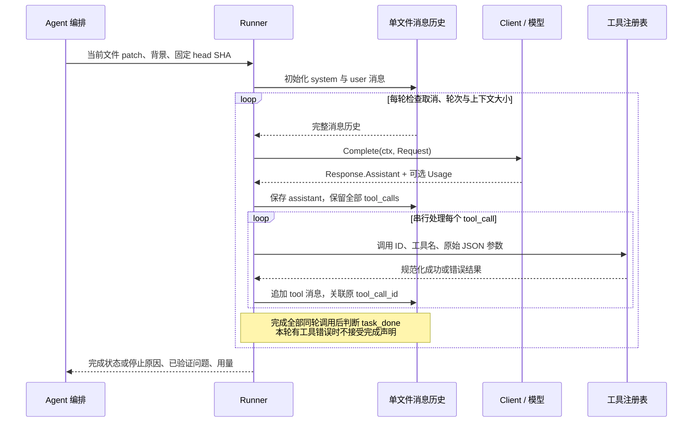

# 第一天设计与验证记录

日期：2026-10-04。对应 [plan1.md](../plan1.md) 的第一天工作范围。

## 模块职责与当前实现

| 模块 | 职责 | 当前状态 |
| --- | --- | --- |
| `cmd/mini-review/main.go` | 调用参数解析，决定退出码 | 已实现；合法输入返回尚未实现提示 |
| `internal/cli/options.go` | 参数默认值、解析、校验、路径绝对化 | 已实现 |
| `internal/model/review.go` | Finding、FileResult、Usage、Report 契约 | 已实现，沿用当前文件命名 |
| `internal/llm/client.go` | Client 接口、消息、工具调用、可空用量 | 已定义；没有真实或 Mock 实现 |
| Git 输入、Agent、Runner、工具 | 固定版本、任务编排、决策闭环、能力执行 | 待实现 |
| 报告渲染、trace | 展示结论与记录执行事件 | 待实现 |

## 完整消息闭环（设计，尚未执行）

模型决定要调用哪个工具，程序负责执行、校验和保存消息。单次请求可以返回多个工具调用；每个结果，包括失败结果，都通过 ToolCallID 与原调用关联。下一轮必须保留 assistant 调用记录与对应 tool 消息，否则模型无法正确理解工具结果。

普通文本回答不等于完成；没有问题也需要合法 task_done。出现合法完成且本轮无工具错误时结束当前文件；超时、取消、上下文或轮次限制也会结束，但应报告未完成。一个文件的完成声明不能代表所有文件完成。

以上是后续 Runner 的目标行为。当前只有接口和数据类型，不能把图中的调用理解为已实现功能。

## 数据契约要点

- Finding 的行号锚定 head 提交。合法位置、枚举和问题内容由后续工具校验，结构体自身不做校验。
- Report.Status 表示整体执行；FileResult.Status 表示一个文件，StopReason 补充完成或停止的具体原因。
- Report 的 Files、Findings、Warnings 应初始化为空 slice，序列化为 `[]`；nil slice 会变成 `null`。
- `Response.Usage == nil` 表示整份用量未提供；存在 TokenUsage 但某个 token 指针为 nil，表示该数值未知。指针指向零表示已知为 0。
- 客户端 usage 是单次请求用量，model.Usage 是整个运行的累计用量，两者的累计转换留给编排层。
- Complete 接收 context；后续客户端实现必须实际响应取消和 deadline，当前接口并不能自动完成取消。

## 第一天验收记录

现有测试覆盖 CLI 默认/显式参数、带空格路径、未知 flag、位置参数、非法 format、非法 ref、轮次 0/1/20/21 和 help。本次补充空白输入、负轮次、相对路径绝对化、重复解析之间状态独立以及有效边界值检查。

模型契约测试位于 `internal/model/review_test.go`，验证完整 JSON 字段、空集合 `[]`、未知 token `null` 和已知零 `0`。消息测试位于 `internal/llm/client_test.go`，验证多工具调用、成功/错误结果关联，以及原始参数和 Schema 的 JSON 表达。

已完成 `gofmt` 格式化，`go test ./...` 与 `go build ./...` 均通过。已在临时目录构建实际可执行程序，并验证以下场景（未通过 `go run` 包装）：

| 场景 | 退出码 | stdout | stderr |
| --- | --- | --- | --- |
| `--help` | 0 | 空 | 参数帮助 |
| `--format=text` | 2 | 空 | 参数错误 |
| `--repo . --base main --head HEAD --format json --mock` | 1 | 空 | Review execution is not implemented yet. |

本次未调用模型，未生成审查报告，未修改被审查代码。保留现有学习注释；尤其 options.go 的中文注释来自明确的学习偏好，新增测试采用英文。

## 已完成与待完成

- [x] 独立 Go 模块与标准库依赖。
- [x] 审查结果与模型消息契约。
- [x] CLI 解析、参数校验、help 和退出码逻辑。
- [x] 全部包测试、构建、实际进程退出码及 stdout/stderr 验证。
- [x] Go 源码 LF 换行与 SPDX 头检查。
- [x] README 的当前能力、运行方式与验证说明。
- [x] 消息闭环设计笔记；这不代表学习者已完成独立理解的验收。
- [ ] 第 2 天：Git ref 解析、固定 SHA、逐文件 patch、新增行号映射。
- [ ] 第 3 天：三个工具、参数校验和 Finding 收集。
- [ ] 第 4 天：Mock 与 Runner 的实际消息循环和停止条件。
- [ ] 第 5 天：真实客户端、prompt、超时取消。
- [ ] 第 6～7 天：报告、trace、样例和端到端演示。

自测时请自己解释：为什么先保存 assistant 再追加 tool；为什么 unknown 不等于 zero；为什么 CLI 参数合法仍返回 1；为什么工具错误会阻止同轮 task_done 被接受。
